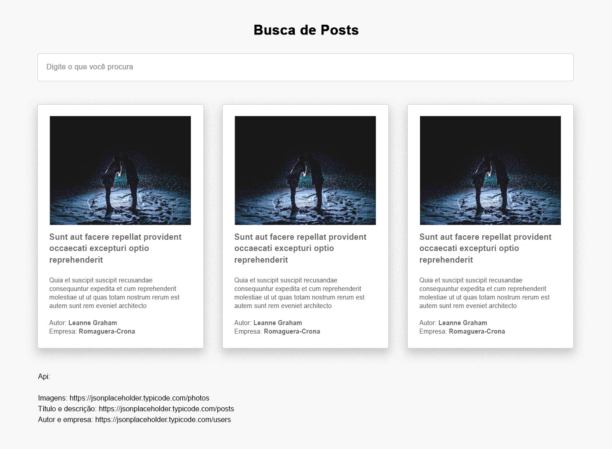

# Desafio - Busca de Posts

## Começando
Para iniciar o desafio é necessário fazer um fork no repositório (Repositório GITHUB).

Após baixar o projeto é necessário os seguintes passos:
- Abra o terminal na pasta de origem do "package.json" e digite **yarn install**
- Digite **yarn dev** e aguarde abrir o projeto no navegador

### Funcionamento da tela
> A tela deverá conter os seguintes componentes:
> - Input de busca
> - Card

> O card deverá conter os seguintes dados:
> - Imagem
> - Título
> - Texto
> - Autor
> - Empresa

### API
> Para a busca dos dados usar a API
> - (Título e texto) - https://jsonplaceholder.typicode.com/posts
> - (Imagens) - https://jsonplaceholder.typicode.com/photos
> - (Autor e empresa) - https://jsonplaceholder.typicode.com/users
>
> Utilizar o parâmetro "id" como referência para exibir todos os dados acima no card.

### Linguagens exigidas
> - ES6 ou superior

### Módulos obrigatórios
> - React (Lifecycles)
> - Redux (Sagas)
> - React Router
> - Node Sass
> - Babel

### Versionamento
> - Saber o básico de Git ou GitFlow

### Funcionalidades
- Listar os cards:

Ao começar a digitar no campo de busca, os cards deverão ser filtrados pelo título, deverão aparecer assincronamente e em ordem alfabética, com seus respectivos dados usando Lazy Loading.

- Posts 

Defina um limite de cards a serem exibidos. Ao rolar a página até o fim, deverá carregar os próximos posts da API.

### Layout

P.S.: É indispensável o uso Redux (Sagas) e os lifecycles do React.

Ao finalizar o desafio, enviar um Pull Request para nosso repositório.
